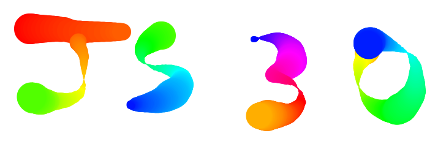

Following Wes Bos' 30 Day Vanilla JS Coding Challenge

***

### Day 01 - [Javascript Drum Kit](https://nayed.github.io/javascript30/01-JavaScript-Drum-Kit)

### Day 02 - [Javascript and CSS Clock](https://nayed.github.io/javascript30/02-JS-and-CSS-Clock)

### Day 03 - [CSS Variables](https://nayed.github.io/javascript30/03-CSS-Variables)

### Day 04 - [Array Cardio Day 1](https://nayed.github.io/javascript30/04-Array-Cardio-Day-1)

### Day 05 - [Flex Panel Gallery](https://nayed.github.io/javascript30/05-Flex-Panel-Gallery)

### Day 06 - [Type Ahead](https://nayed.github.io/javascript30/06-Type-Ahead)

### Day 07 - [Array Cardio Day 2](https://nayed.github.io/javascript30/07-Array-Cardio-Day-2)

### Day 08 - [Fun with HTML5 Canvas](https://nayed.github.io/javascript30/08-Fun-with-HTML5-Canvas)

### Day 09 - [Dev Tools Domination](https://nayed.github.io/javascript30/09-Dev-Tools-Domination)
